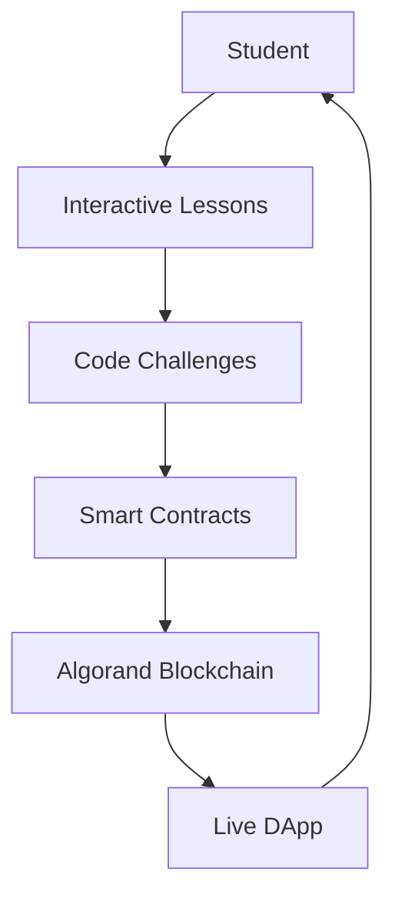
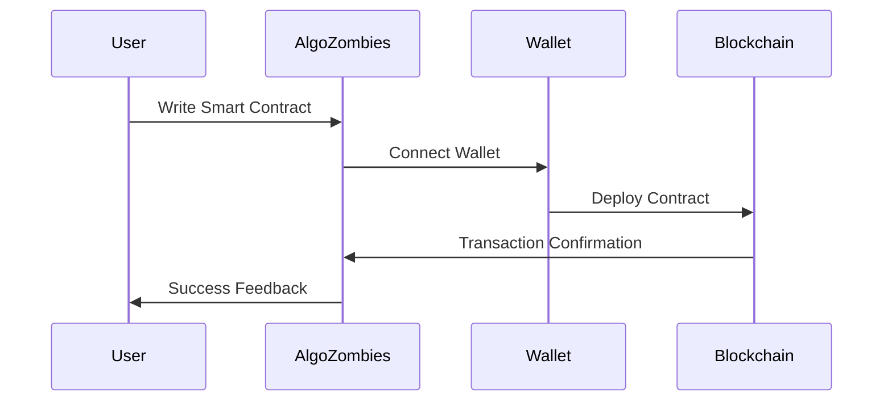
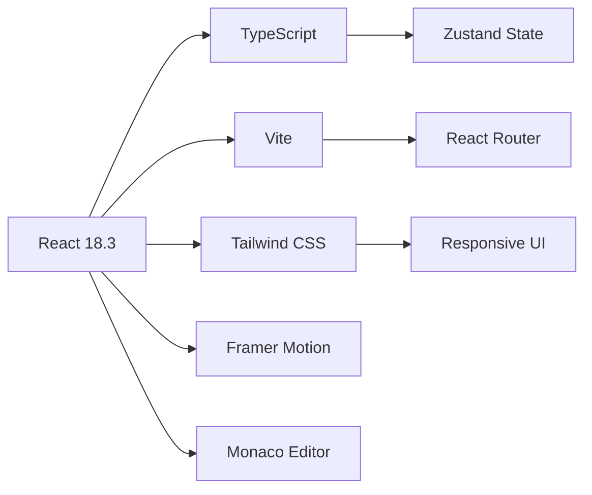
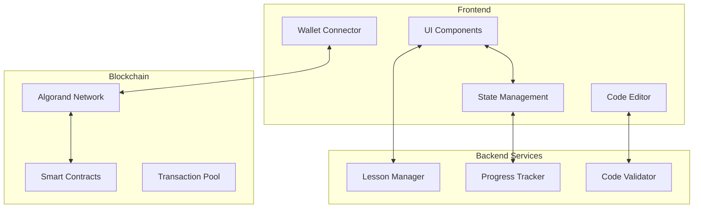

# 🧟‍♂️ AlgoZombies

> Learn Algorand smart contract development through interactive coding challenges inspired by CryptoZombies.


## 📋 Table of Contents

- [Overview](#-overview)
- [Features](#-features)
- [Tech Stack](#-tech-stack)
- [Quick Start](#-quick-start)
- [Learning Path](#-learning-path)
- [Architecture](#-architecture)
- [Development](#-development)
- [Resources](#-resources)

## 🎯 Overview

AlgoZombies transforms Algorand smart contract development education into an engaging, gamified experience. Master PyTeal and TEAL through hands-on coding challenges while building your own zombie-themed blockchain game.



💡 Vision & Mission

Vision: To make blockchain education as addictive as gaming and as accessible as open-source learning.

Mission:

Empower developers to master Algorand smart contract development through play.

Build a global learning community that grows with every completed challenge.

Lower the entry barrier for blockchain devs by turning complexity into creativity.

## ✨ Features

### 🎓 Learning Experience
- **Structured Curriculum**: Progressive lessons from fundamentals to advanced concepts
- **Interactive Code Editor**: Built-in Monaco editor with PyTeal/TEAL support
- **Instant Validation**: Real-time code checking and intelligent hints
- **Progress Analytics**: Comprehensive tracking of your learning journey

### 🔗 Blockchain Integration


### 🏆 Gamification System
- **Experience Points**: Earn XP for completing challenges
- **Achievement Badges**: Unlock milestones and collectibles
- **Learning Streaks**: Maintain consistent progress
- **Global Leaderboards**: Compete with developers worldwide

### 🛠️ Development Environment
- **Dual Language Support**: Learn both PyTeal (Python) and TEAL
- **Code Templates**: Pre-built patterns for rapid development
- **Advanced Debugging**: Comprehensive error reporting and analysis
- **Export Capabilities**: Save and deploy your completed contracts

### 🔒 Security & Privacy
- **Encrypted Storage**: Secure local data management
- **Input Validation**: Multi-layer security validation
- **Rate Limiting**: API abuse protection
- **Privacy Focus**: Minimal data collection practices

## 🛠️ Tech Stack

### Frontend Architecture


### Blockchain Integration
- **Algorand JavaScript SDK** - Blockchain interactions
- **Wallet Connect** - Pera, MyAlgo, Defly support
- **PyTeal Compiler** - Python to TEAL compilation
- **TEAL Interpreter** - Smart contract execution

### Development Ecosystem
```
Development Tools:
├── ESLint + Prettier (Code Quality)
├── TypeScript (Type Safety)
├── Zod (Schema Validation)
├── CryptoJS (Encryption)
└── Jest + Testing Library (Testing)
```

## 🏁 Quick Start

### Prerequisites

Ensure you have the following installed:
- **Node.js** (version 18 or higher)
- **npm** or **yarn** package manager
- **Git** for version control

### Installation Steps

```bash
# Clone the repository
git clone https://github.com/Aniketwarule/CryptoZombies_Algorand.git

# Navigate to project directory
cd CryptoZombies_Algorand

# Install dependencies
npm install

# Configure environment
cp .env.example .env

# Launch development server
npm run dev
```

### Development Scripts

| Command | Purpose |
|---------|---------|
| `npm run dev` | Start development server |
| `npm run build` | Create production build |
| `npm run lint` | Run code linting |
| `npm run lint:fix` | Auto-fix linting issues |
| `npm run preview` | Preview production build |
| `npm run type-check` | TypeScript validation |


### Curriculum Details

1. **🚀 Introduction to Algorand**
   - Blockchain fundamentals
   - Algorand consensus mechanism
   - Network architecture overview

2. **🖊️ Your First PyTeal Contract**
   - PyTeal syntax and structure
   - Contract deployment workflow
   - Basic state management

3. **🎫 Algorand Standard Assets (ASA)**
   - Token creation and management
   - Asset configuration
   - Transfer operations

4. **🧩 Zombie Game Mechanics**
   - Game logic implementation
   - User interaction patterns
   - State transitions

5. **⚡ Advanced Development Patterns**
   - Security considerations
   - Gas optimization techniques
   - Best practices

6. **🌐 DApp Integration**
   - Frontend-blockchain connectivity
   - Wallet integration
   - User experience optimization

## 🏗️ Architecture

### System Architecture


### Project Structure
```
src/
├── components/              # Reusable UI Components
│   ├── ui/                 # Basic UI elements
│   ├── editor/             # Code editor components
│   └── blockchain/         # Blockchain-specific components
├── pages/                  # Application Pages
│   ├── lessons/            # Learning modules
│   ├── challenges/         # Coding challenges
│   └── profile/            # User profile and progress
├── context/                # React Context Providers
│   ├── WalletContext.tsx   # Wallet management
│   └── LessonContext.tsx   # Lesson state
├── hooks/                  # Custom React Hooks
│   ├── useAlgorand.ts      # Blockchain interactions
│   └── useLessons.ts       # Lesson management
├── utils/                  # Utility Functions
│   ├── algorand.ts         # Algorand helpers
│   └── validation.ts       # Code validation
├── types/                  # TypeScript Definitions
│   ├── algorand.ts         # Blockchain types
│   └── lessons.ts          # Lesson types
└── constants/              # Application Constants
    ├── contracts.ts        # Contract templates
    └── lessons.ts          # Lesson data
```

## 🔧 Development

### Getting Started with Development

1. **Environment Setup**
   ```bash
   # Install dependencies
   npm install
   
   # Set up environment variables
   cp .env.example .env
   # Edit .env with your configuration
   ```

2. **Development Workflow**
   ```bash
   # Start development server
   npm run dev
   
   # Run in browser: http://localhost:3000
   ```

### Contribution Guidelines

We welcome contributions! Please follow these steps:

1. **Fork the Repository**
   ```bash
   git fork https://github.com/Aniketwarule/CryptoZombies_Algorand.git
   ```

2. **Create Feature Branch**
   ```bash
   git checkout -b feature/your-feature-name
   ```

3. **Make Your Changes**
   - Follow code style guidelines
   - Add tests for new features
   - Update documentation

4. **Submit Pull Request**
   - Clear description of changes
   - Reference related issues
   - Ensure all tests pass

### Code Quality Standards

- **TypeScript**: Strict type checking enabled
- **ESLint**: Comprehensive linting rules
- **Prettier**: Consistent code formatting
- **Testing**: Component and unit tests

## 🌐 Algorand Resources

### Essential Links
- [**Algorand Developer Portal**](https://developer.algorand.org/) - Official documentation
- [**PyTeal Documentation**](https://pyteal.readthedocs.io/) - PyTeal reference
- [**Algorand SDK**](https://github.com/algorand/js-algorand-sdk) - JavaScript SDK
- [**TestNet Faucet**](https://testnet.algoexplorer.io/dispenser) - Get test ALGO tokens

### Learning Materials
- [Algorand Developer Documentation](https://developer.algorand.org/docs/)
- [Smart Contract Examples](https://github.com/algorand/pyteal/tree/master/examples)
- [Community Forum](https://forum.algorand.org/)
- [Algorand Discord](https://discord.gg/algorand)

## 📄 License

This project is licensed under the **MIT License** - see the [LICENSE](LICENSE) file for complete details.

## 🤝 Acknowledgments

- Inspired by the original [CryptoZombies](https://cryptozombies.io/) platform
- Built for and supported by the **Algorand developer community**
- Special thanks to the **Algorand Foundation** for their support
- Contributions from developers worldwide

---

<div align="center">

**Ready to begin your Algorand development journey?** 🚀

*Start coding with AlgoZombies today and master blockchain development!*

[Get Started](#-quick-start) | [View Lessons](#-learning-path) | [Contribute](#-development)

</div>


